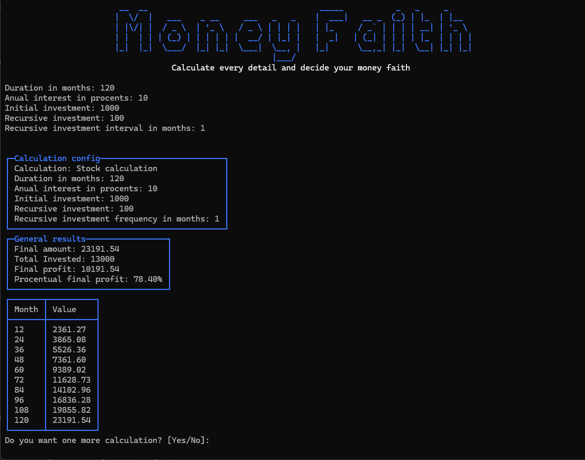

## About
MoneyFaith is a console application created for investment calculations. It is able to calculate the profit for a specified investment scenario for multiple instruments like:
- Simple bond | One initial investment without compounding
- Simple stock | One initial investment with compounding
- Stock | One initial investment followed by recursive investments with compounding

## Technologies
- .NET 10
- Spectre.Console

## Preview
